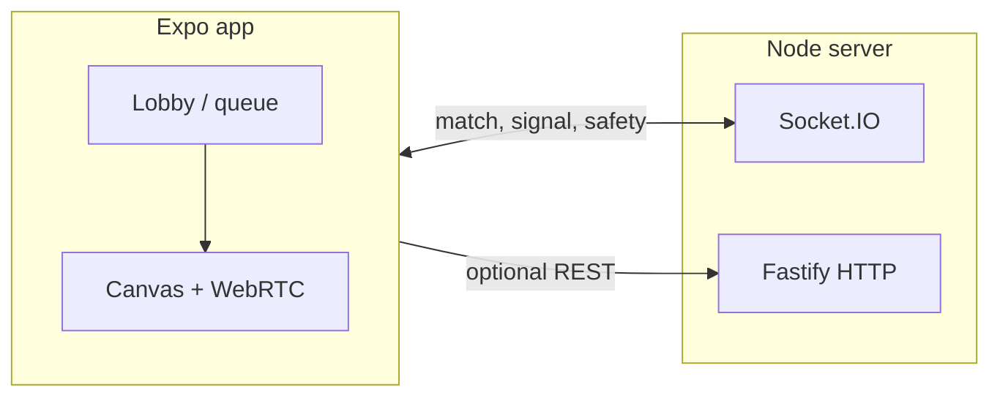

# Architecture (high level)

- **Lobby:** `join_queue` / `leave_queue`; server pairs clients and emits `matched` with `matchId` and offerer flag.
- **Canvas:** WebRTC signaling over the same socket (`offer` / `answer` / `candidate`). TURN/STUN live in `mobile/src/lib/webrtc.ts`.
- **Safety:** report/block/ban paths and moderation stubs are shared between UI and server; admin routes are gated by `ADMIN_TOKEN`.

For deployment, run the server with a public URL/WSS and set `EXPO_PUBLIC_SERVER_URL` for production mobile builds.
