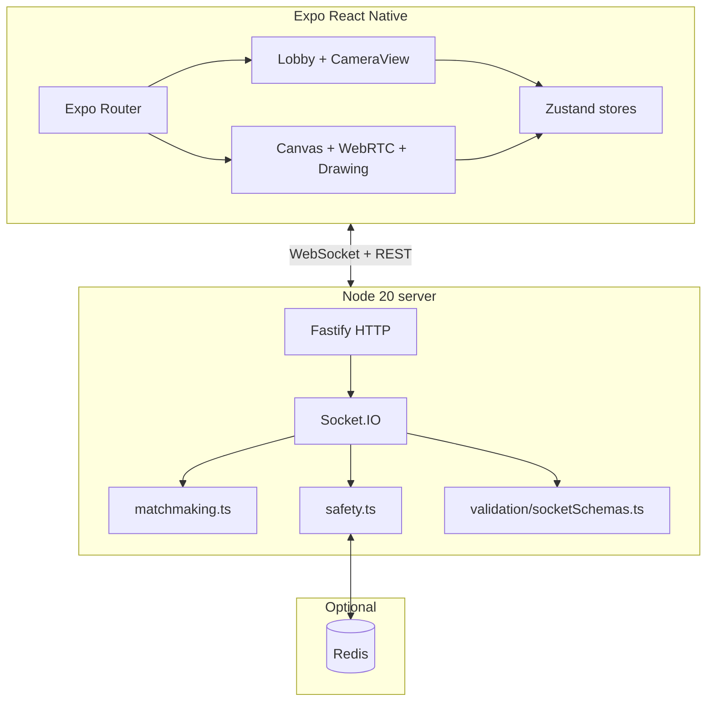

# Architecture

## System diagram

## How pieces fit

1. **HTTP (`Fastify`)** — `/health`, `/stats`, review login, admin HTML + JSON APIs. Registered **before** `app.ready()` where required so route order stays valid.
2. **Socket.IO** — Shares the Fastify HTTP server. CORS mirrors the Fastify `@fastify/cors` policy (`CORS_ORIGIN` or permissive default for dev).
3. **Matchmaking** — Pure functions + async peer lookup in `matchmaking.ts`. Queues are in-memory maps keyed by language, camera mode, and sorted tags.
4. **Safety** — Blocks and bans use Redis sets when `REDIS_URL` is set; otherwise in-memory (development only).
5. **Mobile** — `useGlyphSocket` owns the client socket lifecycle; `useGlyphCall` runs WebRTC after `matched`. Drawing uses a normalized stroke message over the same socket.

## Deployment notes

- Terminate TLS at your edge; expose **WSS** to the app. Set `EXPO_PUBLIC_SERVER_URL` to `https://host:port` for production builds.
- Run **Redis** for multi-instance consistency (`docker-compose.yml` provides a single-node profile).
- Set **`CORS_ORIGIN`** to your web origins if you add a web client; mobile native clients are not subject to browser CORS.

See also [USER_FLOW.md](./USER_FLOW.md), [FEATURES.md](./FEATURES.md), and [SOCKET_API.md](./SOCKET_API.md).
