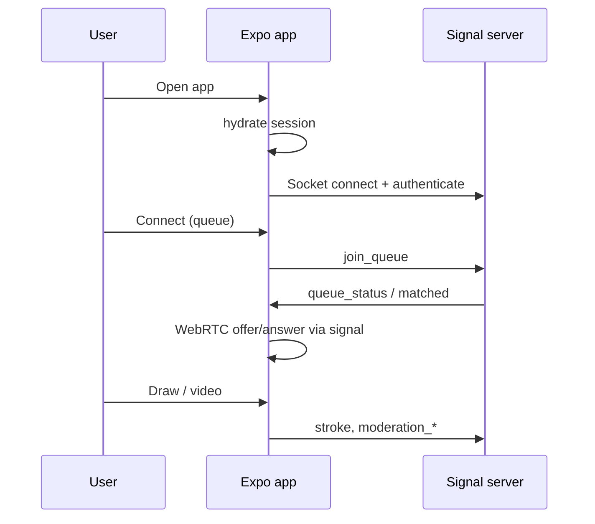

# User flow

1. **Launch** → Session hydrates from AsyncStorage (`sessionStore`).
2. **Onboarding** (first run): sign-in (anonymous / review demo) → safety copy → EULA → gesture tutorial → lobby.
3. **Lobby** → Camera permission + live preview (dimmed). User sets tags, language, drawing-only mode → **Connect**.
4. **Socket** `authenticate` then `join_queue`. Server matches by language, camera mode, tag overlap, and block lists.
5. **Matched** → Navigate to **Canvas**: split video (WebRTC + fallback `CameraView`), shared drawing layer, AR palette, optional wave-to-unblur, icebreaker prompts.
6. **Leave** → Swipe or controls → `disconnect_match`, return to lobby.
7. **Safety** → Report / block from canvas; server records reports; blocks affect future matchmaking; admin can ban via API.

